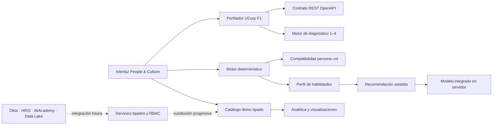

# Itti Talent Compass — Grupo Vázquez

## Propósito

**Itti Talent Compass** es un MVP navegable de Workforce Intelligence para equipos de People & Culture. La experiencia permite explorar talento, administrar instrumentos de evaluación, consultar una ficha 360° y orientar conversaciones de movilidad interna mediante datos explicables. Es una demostración: todos los nombres, resultados, evidencias y organizaciones son ficticios.

> Los indicadores y coincidencias son señales para orientar conversaciones humanas. No son decisiones automáticas de promoción, contratación, exclusión o sanción.

## Alcance funcional de la demostración

| Módulo | Qué permite demostrar |
|---|---|
| Panorama | Indicadores de talento, radar, barras, mapa de calor tabular, alertas y auditoría. |
| Colaboradores | Búsqueda de perfiles sintéticos y acceso a una ficha 360°. |
| Perfil 360° | Habilidades, nivel observado, evidencia, fortalezas, brechas, metodología, confianza y ruta de capacitación asistida. |
| Evaluaciones | Listado de instrumentos, estados, asignación simulada, constructor y flujo de respuesta. |
| Constructor | Navegación por pasos, edición de preguntas, borrador, validación visual y publicación simulada. |
| Perfilador UCorp F1 | Configuración dual, sesión tipada, fallback, revisión HITL, autoevaluación, diagnóstico por flujo y contrato OpenAPI. |
| Movilidad interna | Oportunidades, candidatos, coincidencias, brechas y compatibilidad explicable. |
| Reportes y configuración | Exportación simulada, controles de demo, parámetros organizacionales y auditoría. |

## Datos de demostración

El catálogo tipado en `client/src/data/talentDemo.ts` crea un universo consistente con el alcance del MVP: **80 colaboradores**, **3 empresas**, **8 áreas**, **15 equipos**, **20 cargos**, **25 competencias**, **5 instrumentos** y **10 oportunidades internas**. El conjunto está creado con identidades ficticias y no debe sustituirse por datos personales reales hasta implementar controles de privacidad, autorización, retención y aislamiento por tenant.

## Sistema visual ITTI configurable

El sistema visual utiliza tokens CSS editables, con una base institucional oscura, acento verde de señal y modo claro para el espacio de trabajo. La aproximación toma como referencia señales visuales públicas del sitio institucional de ITTI, pero **no sustituye un manual oficial de marca**. Antes de producción deben validarse el logotipo autorizado, valores cromáticos, tipografías, iconografía, contrastes y reglas de uso con el equipo de marca.

## Arquitectura del MVP

La interfaz usa React, TypeScript, Tailwind CSS 4, componentes accesibles y Recharts. Los datos de la demostración, las reglas determinísticas y el procedimiento de recomendación de aprendizaje viven separados de los componentes visuales, como preparación para reemplazar el catálogo por servicios tipados y persistencia multiempresa.



| Capa | Responsabilidad en este MVP | Evolución prevista |
|---|---|---|
| Interfaz | Navegación, formularios, vistas, estados y accesibilidad. | Mantener componentes reutilizables y consumir procedimientos tipados. |
| Datos demo | Escenarios sintéticos visibles desde el primer acceso. | Sustituir por repositorios con tenant, permisos y paginación. |
| Motor | Normalización, ponderación, brechas y compatibilidad explicable. | Versionar fórmulas, persistir evidencias y registrar recálculos. |
| Perfilador F1 | Configuración, sesión, HITL, autoevaluación, diagnóstico y OpenAPI en modo demo. | Conectar fuentes, RBAC, persistencia, auditoría inmutable y evidencia documental. |
| Recomendación asistida | Envía solo señales mínimas de desarrollo al servidor y valida una ruta educativa estructurada. | Conectar catálogo aprobado, RBAC, consentimiento y auditoría de uso sin contenido sensible. |
| Gobierno | Señales de rol, auditoría y exportaciones simuladas. | Aplicar RBAC real en servidor, aislamiento, retención y auditoría persistente. |

## Recomendaciones de capacitación asistidas

En cada ficha 360° está disponible una **ruta de capacitación personalizada**. El asistente recibe el rol, seniority, intereses de desarrollo, niveles observados y esperados de competencia, cantidad de evidencias y estado de evaluación. No recibe identidad, correo, ubicación, equipo, respuestas ni comentarios de evaluación. La respuesta se valida como JSON estructurado antes de mostrarse y plantea entre dos y tres actividades educativas genéricas, una pregunta de conversación y el recordatorio de revisión humana.

> La función prepara una conversación de desarrollo. No puntúa personas, no hace predicciones laborales y no toma decisiones de promoción, movilidad, compensación, selección o permanencia.

El contrato, las exclusiones de datos y la preparación para producción están documentados en [`docs/ai-learning-recommendations.md`](docs/ai-learning-recommendations.md).

## Perfilador UCorp F1

El Perfilador F1 implementa H2–H8 del piloto y excluye **H1 — autenticación** por decisión de alcance. Se abre desde la navegación lateral o directamente en `/?view=pilot`; trabaja con el área de Producto, 12 colaboradores sintéticos y fuentes demo editables. La experiencia contiene una configuración dual de valores y competencias, generación con fallback, revisión humana obligatoria, evaluación retomable, diagnóstico separado por flujo y una especificación REST en [`/api/v1/openapi.json`](/api/v1/openapi.json). [2]

| Regla | Implementación de demo |
|---|---|
| Extensión | Rápida: 5 preguntas; estándar: 10; profunda: 15. |
| Escala común | Las respuestas se normalizan a niveles de 1 a 4. |
| Diagnóstico | Tolerancia configurable de 0,12; brecha crítica por debajo, aceptable dentro y destacado por encima. |
| HITL | No se distribuye una sesión sin todos los flujos activos y rúbricas completas para escenarios. |
| Inmutabilidad | El envío de la autoevaluación bloquea la edición posterior. |

> El diagnóstico orienta una conversación de desarrollo; no automatiza decisiones de empleo. Movilidad interna y capacitación asistida son capacidades futuras fuera del alcance del piloto F1.

La matriz completa de implementación, criterios y límites está disponible en [`docs/pilot-f1-traceability.md`](docs/pilot-f1-traceability.md).

El inventario de código, documentación y archivos fuente a incorporar al repositorio privado se encuentra en [`docs/repository-inventory.md`](docs/repository-inventory.md).

## Ejecutar localmente

El proyecto utiliza `pnpm` y requiere Node.js 22 o una versión compatible.

```bash
pnpm install
pnpm dev
```

Para validar tipos y la suite de pruebas:

```bash
pnpm check
pnpm test
pnpm test:a11y
```

## Pruebas incluidas

La suite de Vitest cubre el cálculo de normalización, ponderaciones, brechas, compatibilidad explicable, integridad mínima del catálogo sintético, el contrato de la recomendación asistida y el Perfilador UCorp F1. Las pruebas F1 cubren normalización, fronteras de tolerancia, aprobación HITL, respuestas faltantes, composición por extensión, diagnóstico por flujo y el contrato OpenAPI. El comando `pnpm test:a11y` ejecuta Axe sobre la vista inicial con reglas WCAG 2 A, AA y 2.1 AA. La extensión hacia datos reales debe añadir pruebas de autorización de servidor, separación entre tenants, persistencia, auditoría y flujos de extremo a extremo.

## Integraciones pendientes

| Integración | Preparación actual | Requisito antes de conectar |
|---|---|---|
| Okta | Selector de rol de demostración y contratos de UI. | OIDC/SAML, mapeo de grupos y RBAC de servidor. |
| HRIS | Modelo de persona, equipo, cargo y tenant. | Contrato de sincronización, retención y revisión de identidad. |
| IttiAcademy | Rutas genéricas ya operativas en la ficha 360°. | Catálogo de aprendizaje aprobado, taxonomía de contenidos y consentimiento de datos. |
| Data Lake / reportería | Métricas agregadas y exportación simulada. | Anonimización, catálogo semántico y política de acceso. |
| Modelo de IA integrado | Ruta educativa estructurada, validada y ejecutada en servidor. | Revisión humana, RBAC, evaluación de sesgo, límite de uso, auditoría sin contenido sensible y proceso de corrección. |

## Limitaciones conscientes

El MVP no implementa autenticación corporativa real, base de datos funcional para las entidades de talento, exportación de archivos reales, carga de evidencias ni integraciones externas. Estas funciones se representan como flujos interactivos para validar la experiencia, sin simular seguridad o conectividad inexistentes.

## Referencia visual

[1] [ITTI — Sitio institucional](https://www.itti.digital/)
[2] [Trazabilidad del Perfilador UCorp F1](docs/pilot-f1-traceability.md)
