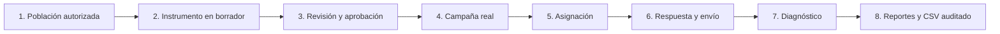
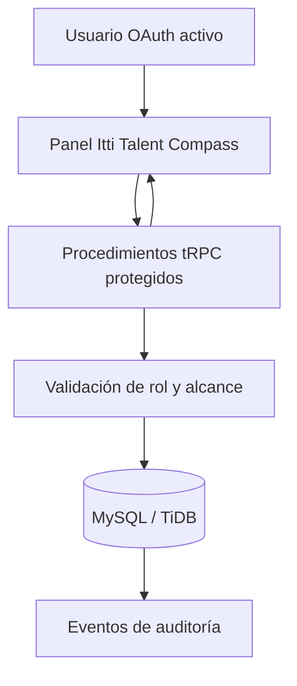

# Itti Talent Compass — Manual operativo de People & Culture

**Itti Talent Compass** es la plataforma de Workforce Intelligence de Grupo Vázquez para configurar evaluaciones, acompañar su ejecución y revisar resultados de talento dentro de un piloto controlado. Este README funciona como guía de uso para el equipo de **People & Culture**, administración de plataforma y participantes autorizados.

> **Principio de uso responsable.** La plataforma organiza señales y resultados para preparar conversaciones de desarrollo. No toma decisiones automáticas de promoción, contratación, movilidad, compensación, exclusión o sanción. Todo diagnóstico requiere interpretación humana y contexto organizacional.

| Información | Valor |
|---|---|
| Producto | Itti Talent Compass |
| Público principal | People & Culture y Administración de plataforma |
| Datos operativos | MySQL/TiDB, mediante procedimientos protegidos de servidor |
| Acceso | Sesión OAuth aprobada y rol activo |
| Alcance real | Tenant, piloto, campaña y participante autorizados |
| Repositorio de entrega | [`AlejoRoldan/perfiladorV1`](https://github.com/AlejoRoldan/perfiladorV1), rama `perfiladorOPOSV1` |

## Para desarrolladores

El repositorio incorpora una guía de contribución, un portal documental, una plantilla de revisión y un mapa técnico de módulos. Empiece por [`CONTRIBUTING.md`](CONTRIBUTING.md), continúe con [`docs/architecture/README.md`](docs/architecture/README.md) y use [`docs/README.md`](docs/README.md) para localizar documentación operativa, de producto y de calidad.

## 1. Cómo pensar el ciclo de evaluación

Una evaluación en la plataforma funciona como un **expediente controlado**. People & Culture crea la pauta, la aprueba, la convierte en campaña, asigna a las personas habilitadas y luego revisa resultados antes de exportarlos. Del mismo modo que un expediente físico no debería circular sin responsable, cada etapa conserva alcance, estado y trazabilidad.



| Etapa | Responsable habitual | Resultado que habilita la siguiente etapa |
|---|---|---|
| Población | Administración / People & Culture | Participantes del piloto vinculados a identidad activa. |
| Instrumento | People & Culture | Pauta versionada y validada. |
| Revisión | People & Culture | Versión aprobada e inmutable. |
| Campaña | People & Culture | Ventana de evaluación ligada a un instrumento aprobado. |
| Asignación | People & Culture | Expediente individual disponible para cada participante. |
| Respuesta | Colaborador | Respuestas guardadas y envío definitivo. |
| Diagnóstico | People & Culture | Resultado determinístico versionado para revisión humana. |
| Reportes | People & Culture / Administración | Métricas protegidas y exportación con finalidad registrada. |

## 2. Acceso, roles y primer ingreso

La autenticación confirma la identidad que entra al sistema; la autorización decide a qué salas puede entrar esa identidad. Por esta razón, iniciar sesión no basta por sí solo para acceder a información del piloto: la cuenta debe estar habilitada y tener el rol adecuado.[1]

### Primer ingreso de una persona

1. La persona inicia sesión con el proveedor OAuth configurado para la plataforma.
2. En el primer acceso queda registrada inicialmente con estado **`invited`**.
3. Un administrador abre **Configuración → Identidades autorizadas**, verifica la identidad, asigna el rol mínimo necesario y cambia el estado a **`active`**.
4. Desde ese momento, la navegación y las acciones disponibles se ajustan al rol; el servidor vuelve a comprobarlo en cada operación protegida.

| Estado de la identidad | Qué significa | Acción recomendada |
|---|---|---|
| `invited` | La identidad existe, pero no puede operar el piloto. | Revisar identidad, rol y autorización antes de activarla. |
| `active` | Puede ejecutar las acciones habilitadas por su rol. | Mantener el menor privilegio necesario. |
| `suspended` | Su sesión ya no puede consultar ni modificar el piloto. | Usar ante salida del piloto, cambio de función o incidente. |

### Qué puede hacer cada rol

| Rol | Uso principal dentro del panel | Límite importante |
|---|---|---|
| **Colaborador** | Consultar su recorrido y completar únicamente las evaluaciones que le fueron asignadas. | No administra campañas, accesos ni reportes. |
| **Líder de equipo** | Consultar las vistas acotadas habilitadas para su función. | No administra campañas, exportaciones ni configuración. |
| **People & Culture** | Gestionar población, instrumentos, campañas, evaluaciones y reportes del alcance autorizado. | No modifica roles, identidades ni parámetros globales. |
| **Administración de plataforma** | Gestionar identidad, activación, suspensión, roles y todas las vistas operativas. | No debe retirar ni degradar su propio acceso administrativo activo. |

> **Regla práctica:** si una persona no necesita configurar campañas ni revisar resultados, no debe recibir permisos de People & Culture o Administración. Es más seguro añadir acceso cuando se justifica que retirarlo después de que la información ya fue consultada.

## 3. Recorrido del panel de control

La barra lateral organiza el trabajo por contexto. El equipo no necesita memorizar rutas técnicas: debe seguir el orden de la operación y usar la siguiente acción sugerida por el **Ciclo de evaluación**.

| Sección del panel | Para qué se usa | Cuándo entrar |
|---|---|---|
| **Panorama** | Contexto agregado de talento y navegación hacia las áreas de trabajo. | Al iniciar la jornada o preparar una conversación de talento. |
| **Colaboradores** | Consulta de perfiles autorizados y su información de desarrollo. | Para acompañar una conversación individual, sin reemplazar la evidencia del ciclo real. |
| **Ciclo de evaluación** | Centro operativo de población, instrumentos, campañas, respuestas y diagnóstico. | Para preparar o dar seguimiento al proceso E2E. |
| **Datos del piloto** | Consulta del tenant, piloto y población autorizada. | Antes de crear instrumentos o campañas. |
| **Reportes** | Seguimiento por campaña, detalle protegido y exportación CSV auditada. | Después de que existan evaluaciones enviadas y diagnósticos. |
| **Configuración** | Gestión de identidades y accesos de plataforma. | Solo para Administración de plataforma. |
| **Movilidad · futuro** | Referencia de evolución de producto. | No debe utilizarse como decisión de movilidad automatizada. |

### Comprobación inicial antes de operar

Al entrar a **Ciclo de evaluación**, confirme tres elementos antes de crear información:

1. El **tenant** es el correcto para la unidad organizacional que va a gestionar.
2. El **piloto** activo es el aprobado para la cohorte que se evaluará.
3. La tarjeta de población indica que los participantes y sus vínculos OAuth están preparados.

El piloto real no crea datos ficticios cuando está vacío. Si aún no existen instrumentos, participantes o respuestas, el panel mostrará un estado vacío y la siguiente acción necesaria. Esta conducta es intencional: evita confundir la demostración visual con un resultado real.[2]

## 4. Preparar la población del piloto

Antes de abrir una campaña, cada participante debe pertenecer al mismo tenant y piloto y contar con una **cuenta OAuth activa vinculada**. Una persona puede estar registrada como invitada en el piloto, pero no recibirá ni podrá abrir una evaluación hasta que su identidad esté activa.[2]

| Validación | Quién la confirma | Motivo |
|---|---|---|
| Identidad OAuth creada | Administración de plataforma | Establece la identidad autenticada de la persona. |
| Estado `active` | Administración de plataforma | Evita que una invitación pendiente acceda a datos. |
| Rol mínimo adecuado | Administración de plataforma | Aplica el principio de menor privilegio. |
| Participante dentro del tenant y piloto correctos | People & Culture / Administración | Evita mezclar cohortes o empresas. |
| Código operativo de reporte | People & Culture | Permite seguimiento protegido sin exponer nombres en reportes. |

> No copie respuestas o diagnósticos de una campaña anterior para “probar” la nueva. Los resultados deben pertenecer a la persona, instrumento, campaña y periodo que realmente representan.

## 5. Configurar y aprobar un instrumento

Un instrumento es la pauta que define **qué se evalúa y cómo se interpreta**. La plataforma usa un borrador persistente y, al aprobarlo, genera una versión inmutable con checksum. Esto equivale a firmar una pauta: una vez firmada, no se reescribe; si hay un cambio, se crea una nueva versión.[3]

### Paso a paso

1. Abra **Ciclo de evaluación** y seleccione **Abrir constructor persistente**.
2. Seleccione el perfil de referencia, el tipo de evaluación y las competencias que se observarán.
3. Redacte o ajuste preguntas, pesos, evidencias y etiquetas de escala.
4. Guarde el contenido como **borrador** mientras se encuentre en construcción.
5. Cuando la pauta represente el acuerdo de People & Culture, seleccione **Enviar a revisión**.
6. Revise alcance, matriz, fórmula, preguntas y nota de revisión.
7. Seleccione **Aprobar versión** solo cuando la pauta esté lista para aplicarse. La versión aprobada será la única que podrá vincularse a una campaña.

| Estado del instrumento | Acciones disponibles | Significado operativo |
|---|---|---|
| `draft` | Editar, guardar y enviar a revisión. | La pauta aún puede cambiar. |
| `in_review` | Revisar y aprobar con nota. | Se bloquea la edición para preservar la versión revisada. |
| `approved` | Crear una versión nueva si se requiere cambio. | Se conserva un snapshot inmutable, checksum y trazabilidad. |

### Validaciones que debe cumplir

El constructor exige un perfil de referencia, al menos una competencia, dos preguntas ponderadas en escala de 1 a 4 y tres etiquetas visibles de escala. Si falta una de estas piezas, la pauta no debe pasar a revisión. Las acciones de guardado, solicitud de revisión y aprobación generan eventos de auditoría.[3]

## 6. Crear una campaña y asignar evaluaciones

Una campaña es la ventana concreta en la que un instrumento aprobado se aplica a una población. Para evitar desorden, use una campaña por propósito, cohorte y periodo claramente definidos.

### Secuencia recomendada

1. En **Ciclo de evaluación**, elija crear campaña desde un instrumento que esté en estado **`approved`**.
2. Defina el nombre operativo, la ventana de inicio y cierre y la zona horaria que usará el piloto.
3. Confirme que la población elegida pertenece al mismo tenant y piloto.
4. Asigne la campaña únicamente a participantes con cuenta OAuth activa y vinculada.
5. Revise la pantalla de resumen antes de iniciar la ventana, verificando instrumento, periodo y cantidad de asignaciones.

| Punto de control | Qué comprobar antes de avanzar |
|---|---|
| Instrumento | Es la versión aprobada correcta y refleja las competencias acordadas. |
| Fechas | Inicio, cierre y zona horaria coinciden con la comunicación al piloto. |
| Población | No existen participantes de otro tenant, piloto o cohorte. |
| Identidad | Todas las personas asignadas tienen una cuenta OAuth activa vinculada. |
| Alcance | La campaña tiene propósito claro; no se reutiliza para fines distintos. |

La creación de campaña, la asignación y la lectura posterior se ejecutan en servidor. El navegador no tiene acceso directo a la base de datos ni puede ampliar el alcance cambiando parámetros de la interfaz.[2]

### Avisos de campaña

El planificador heredado de avisos internos registra hitos de apertura, mitad de periodo y 48 horas antes del cierre para participantes pendientes. No envía mensajes externos por correo o mensajería corporativa. Para el piloto real, trate estos avisos como apoyo de seguimiento interno; cualquier comunicación masiva debe respetar el flujo autorizado de People & Culture y la integración corporativa que se apruebe.[4]

## 7. Experiencia de la persona evaluada

Cuando una evaluación está asignada, la persona la encuentra en su bandeja personal. El servidor limita esa bandeja a sus propios expedientes; una persona no puede ver respuestas o evaluaciones de otra aunque altere una dirección o parámetro en el navegador.[2]

1. El colaborador inicia sesión con su identidad activa.
2. Abre la evaluación asignada desde su bandeja personal.
3. Responde según la escala y guarda el avance cuando corresponda.
4. Comprueba las respuestas antes de seleccionar **Enviar**.
5. Tras el envío, la evaluación queda bloqueada y no puede editarse.

> Explique a cada participante que “Enviar” significa cerrar el expediente para preservar la integridad del diagnóstico. Si se detecta una situación excepcional, People & Culture debe gestionar la corrección mediante el proceso acordado; no debe intentar alterar respuestas directamente en la base de datos.

## 8. Revisar y calcular diagnósticos

Después de recibir evaluaciones enviadas, People & Culture puede solicitar el cálculo de diagnóstico. El cálculo es **determinístico**: parte del instrumento aprobado, utiliza la versión registrada de la fórmula y conserva cobertura y brechas como evidencia de análisis.[2]

| Antes de calcular | Después de calcular |
|---|---|
| Verifique que las respuestas estén enviadas y correspondan a la campaña correcta. | Revise puntaje, cobertura, brechas y estado de diagnóstico dentro del alcance autorizado. |
| Confirme que el instrumento aprobado representa el criterio acordado. | Prepare una conversación humana de devolución; no entregue el resultado como una decisión automática. |
| Identifique evaluaciones incompletas o fuera de plazo antes de interpretarlas. | Registre las acciones de desarrollo acordadas fuera de la evaluación si así lo define la política interna. |

El diagnóstico es una señal de desarrollo, no una etiqueta permanente de la persona. Use el resultado junto con contexto de rol, evidencias relevantes y una conversación respetuosa.

## 9. Consultar resultados y exportar CSV

La sección **Reportes** presenta únicamente información persistida del tenant y piloto autorizados. Si aún no hay evaluaciones asignadas, enviadas o diagnosticadas, verá valores en cero y una explicación del siguiente paso pendiente; no se generan métricas de relleno.[5]

### Cómo usar el panel de resultados

1. Abra **Reportes** desde la sección Gobierno.
2. Confirme el alcance visible de tenant y piloto.
3. Filtre por campaña cuando necesite analizar una ventana específica.
4. Revise los indicadores de **Asignadas**, **Enviadas**, **Diagnosticadas** y **Promedio observado**.
5. Consulte el detalle protegido por **código de reporte**, no por nombre visible.
6. Si existe una necesidad legítima, escriba una **finalidad de exportación** concreta antes de seleccionar **Exportar CSV**.

| Métrica o campo | Uso apropiado | Precaución |
|---|---|---|
| Asignadas | Seguir el volumen de trabajo abierto. | No equivale a respuesta ni resultado. |
| Enviadas | Dar seguimiento a finalización de campaña. | Revisar ventana y población antes de interpretar. |
| Diagnosticadas | Confirmar que hay resultado calculado y versionado. | No sustituye la revisión de People & Culture. |
| Promedio observado | Observar una señal agregada de campaña. | No usar como único criterio sobre una persona o equipo. |
| Código de reporte | Conciliar casos sin exponer nombres en la tabla. | No intentar reidentificar información fuera de la finalidad autorizada. |

### Qué incluye la exportación y cómo se audita

La exportación CSV se genera en el servidor y exige pertenencia activa a People & Culture o Administración. Incluye código de reporte, campaña, estado y fechas operativas, puntaje o estado de diagnóstico, versión de fórmula, tenant y piloto. Cada solicitud registra actor, alcance, campaña y finalidad en la auditoría; el contenido sensible no se duplica dentro del log.[5]

> Antes de exportar, formule la finalidad en una frase concreta, por ejemplo: “Preparar la revisión de cierre de la campaña de liderazgo del piloto F1”. Evite finalidades vagas como “análisis” o “por si acaso”.

## 10. Seguridad y protección de la información

La plataforma aplica aislamiento por **tenant**, **piloto** y, cuando existe una persona concreta, por **participante** y relación con su usuario autenticado. Las verificaciones ocurren en servidor antes de leer o escribir la base de datos.[2]

| Práctica obligatoria | Por qué importa |
|---|---|
| Usar cuentas individuales y nunca compartir sesiones. | Mantiene la trazabilidad de quién hizo cada acción. |
| Asignar el rol mínimo necesario. | Reduce exposición innecesaria de datos de talento. |
| Confirmar tenant y piloto antes de crear o exportar. | Evita mezclar cohortes o compañías. |
| Describir la finalidad de toda exportación. | Da contexto auditable al uso del archivo. |
| Usar códigos de reporte para seguimiento. | Reduce la exposición de identidad en vistas y archivos operativos. |
| Mantener la revisión humana en diagnósticos. | Evita convertir una señal analítica en una decisión automática. |

No introduzca nombres, respuestas o diagnósticos reales en las vistas que indiquen explícitamente datos de demostración. Antes de incorporar archivos de personal o integrar un HRIS, debe existir una aprobación formal de privacidad, retención, acceso, minimización de datos y trazabilidad operativa.

## 11. Resolución de situaciones frecuentes

| Situación | Causa probable | Acción del equipo |
|---|---|---|
| Una persona inicia sesión pero no accede al panel. | Está `invited` o `suspended`, o no tiene un rol habilitado. | Administración debe revisar identidad, estado y rol en Configuración. |
| No aparece un participante al asignar. | No pertenece al piloto/tenant actual o no tiene cuenta OAuth activa vinculada. | Revise población e identidad antes de crear la asignación. |
| No se puede crear campaña. | No hay un instrumento aprobado en el mismo piloto. | Complete revisión y aprobación; no intente usar un borrador. |
| No se puede editar una evaluación enviada. | El envío es definitivo para proteger la integridad. | Active el procedimiento interno de corrección, sin modificar registros directamente. |
| Reportes muestra cero. | Aún no existen asignaciones, envíos o diagnósticos persistidos. | Siga la siguiente etapa del ciclo mostrada en el panel. |
| No aparece el botón de exportar o falla la descarga. | Rol insuficiente, finalidad vacía o alcance no autorizado. | Confirme rol, tenant, piloto, campaña y escriba una finalidad específica. |
| Se necesita cambiar una pregunta aprobada. | La versión aprobada es inmutable. | Cree una nueva versión del instrumento y apruébela antes de una nueva campaña. |

## 12. Operación sugerida para una campaña de piloto

| Momento | Responsable | Verificación de salida |
|---|---|---|
| Preparación | Administración + People & Culture | Identidades activas, roles correctos y población en el piloto adecuado. |
| Diseño | People & Culture | Instrumento guardado, revisado y aprobado. |
| Lanzamiento | People & Culture | Campaña con fechas correctas, instrumento aprobado y asignaciones válidas. |
| Seguimiento | People & Culture | Estado de envío revisado sin exponer información fuera del alcance. |
| Cierre | People & Culture | Diagnósticos calculados, revisados y contextualizados. |
| Reporte | People & Culture / Administración | Filtros verificados, exportación justificada y auditoría disponible. |

## 13. Arquitectura resumida

La interfaz usa **React 19**, **TypeScript** y **Tailwind CSS 4**. El servidor usa **Express 4**, **tRPC 11**, **Drizzle ORM** y una conexión administrada a **MySQL/TiDB**. La aplicación no expone SQL al navegador: cada acción viaja a un procedimiento de servidor que valida sesión, rol y alcance antes de persistir.



| Componente | Responsabilidad |
|---|---|
| `talent_tenants`, `talent_pilots`, `talent_tenant_members` | Contexto organizacional y membresías autorizadas. |
| `pilot_participants` | Población del piloto y vínculo con identidades activas. |
| `pilot_instrument_drafts`, `pilot_instruments` | Borradores, versiones aprobadas, checksum e inmutabilidad. |
| `assessment_campaigns`, `assessment_campaign_participants` | Ventanas y población de cada campaña. |
| `pilot_assessments`, `pilot_assessment_answers` | Expediente de evaluación y respuestas por pregunta. |
| `pilot_diagnoses` | Diagnósticos versionados, brechas y cobertura. |
| `pilot_audit_events` | Evidencia de acciones y exportaciones sin duplicar contenido sensible. |

## 14. Desarrollo y comprobaciones técnicas

Para ejecutar el proyecto de forma local se requiere Node.js 22 o una versión compatible y `pnpm`.

```bash
pnpm install
pnpm dev
```

Para validar tipos, pruebas y accesibilidad:

```bash
pnpm check
pnpm test
pnpm test:a11y
```

No se deben versionar archivos `.env`, credenciales ni copias de datos reales. Las variables de conexión y autenticación se gestionan en el entorno administrado.

## 15. Documentación de referencia

Este README es la guía de entrada. Para procedimientos más específicos, consulte los documentos vinculados a continuación antes de operar un proceso no habitual.

| Documento | Cuándo consultarlo |
|---|---|
| [Operación de identidad y control de acceso](docs/access-control-operation.md) | Alta, baja, suspensión, roles y límites de permisos. |
| [Operación del constructor persistente](docs/persistent-instrument-operation.md) | Diseño, revisión y aprobación de instrumentos. |
| [Operación persistente de evaluaciones](docs/evaluation-persistence-operation.md) | Campañas, asignaciones, respuestas, diagnóstico y aislamiento. |
| [Panel de resultados persistidos](docs/results-dashboard-operation.md) | Filtros, métricas, detalle protegido y CSV auditado. |
| [Almacenamiento de participantes reales](docs/pilot-real-participants-storage.md) | Preparación para incorporar la cohorte real del piloto. |
| [Hoja de ruta E2E](docs/e2e-talent-platform-roadmap.md) | Alcance actual, brechas y evolución priorizada. |

## Referencias

[1] [Operación de identidad y control de acceso](docs/access-control-operation.md)

[2] [Operación persistente de evaluaciones — MySQL/TiDB](docs/evaluation-persistence-operation.md)

[3] [Operación del constructor persistente de instrumentos](docs/persistent-instrument-operation.md)

[4] [Campañas de evaluación y avisos internos](docs/campaigns-operation.md)

[5] [Panel de resultados persistidos](docs/results-dashboard-operation.md)
