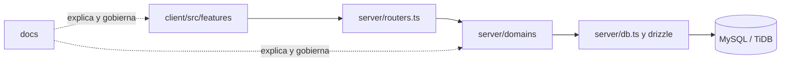

# Arquitectura y mapa del repositorio

## Principio de organización

El código se organiza por **fronteras de responsabilidad**, no por el orden en que se creó. La interfaz muestra y recoge acciones; el servidor aplica permisos y reglas; la base de datos conserva los registros; la documentación explica cómo operar y evolucionar el sistema.



## Estructura de carpetas

```text
.
├── client/
│   └── src/
│       ├── components/      # Elementos visuales reutilizables y UI base
│       ├── contexts/        # Estado transversal de interfaz
│       ├── data/            # Datos de demostración explícitamente sintéticos
│       ├── features/        # Flujos visibles organizados por dominio
│       │   ├── assessments/ # Instrumentos, campañas, respuestas y reportes
│       │   └── profiling/   # Perfilador, sesiones y experiencia individual
│       ├── lib/             # Utilidades y reglas puras de cliente
│       └── pages/           # Composición de pantallas raíz
├── server/
│   ├── _core/               # Infraestructura provista por la plataforma
│   ├── domains/             # Reglas de negocio agrupadas por responsabilidad
│   ├── db.ts                # Acceso de bajo nivel a persistencia
│   └── routers.ts           # Contrato y composición tRPC
├── drizzle/                 # Esquema y migraciones de base de datos
├── docs/                    # Manuales, arquitectura, producto y calidad
├── scripts/                 # Automatizaciones de desarrollo verificables
├── shared/                  # Tipos y constantes compartidos entre capas
├── CONTRIBUTING.md          # Flujo de trabajo para desarrollo
└── README.md                # Manual operativo de entrada
```

## Dominios de servidor

| Dominio | Responsabilidad | Ejemplos de archivos |
|---|---|---|
| `access` | Identidad, autorización y control de alcance. | `pilotScope.ts`, pruebas de autorización. |
| `campaigns` | Campañas, estados y recordatorios internos. | `campaigns.ts`, `campaignsDomain.ts`. |
| `learning` | Recomendaciones de capacitación con revisión humana. | `learningRecommendations.ts`. |
| `pilot` | Instrumentos, participantes, asignaciones, respuestas y diagnósticos. | `pilotRepository.ts`. |
| `reporting` | Exportaciones y presentación de resultados. | `reportExports.ts`. |
| `openapi` | Contratos externos de referencia del Perfilador. | `openapi.ts`. |

Cada dominio contiene sus pruebas cerca del código que verifica. El archivo `server/routers.ts` solo compone procedimientos, valida entradas y delega al dominio; no debe convertirse en el lugar donde se concentra la lógica de negocio.

Las guías locales [`server/domains/README.md`](../../server/domains/README.md) y [`client/src/features/README.md`](../../client/src/features/README.md) explican cómo extender estas zonas sin cruzar responsabilidades.

## Reglas de dependencia

| Desde | Puede depender de | No debe depender de |
|---|---|---|
| `client/src/features` | componentes, `lib`, hooks y cliente tRPC | SQL, Drizzle o secretos de servidor |
| `server/routers.ts` | `_core`, `domains`, `db`, `shared` | componentes o datos demo de cliente |
| `server/domains` | `db`, `shared`, validadores de dominio | UI de React |
| `drizzle/` | tipos y configuración de persistencia | componentes o flujos de pantalla |
| `docs/` | archivos de Markdown y enlaces de referencia | secretos, identificadores privados o datos personales |

## Dónde realizar un cambio

| Cambio solicitado | Primer lugar que debe revisar |
|---|---|
| Nueva pantalla o ajuste de una operación visible | `client/src/features/<dominio>/` |
| Nueva regla de cálculo o diagnóstico | `server/domains/pilot/` y su prueba correspondiente |
| Nueva campaña, transición o aviso | `server/domains/campaigns/` |
| Nuevo campo persistido | `drizzle/schema.ts`, seguida de migración y repositorio de dominio |
| Nuevo permiso o rol | `shared/`, los procedimientos de servidor y `docs/access-control-operation.md` |
| Nuevo reporte o CSV | `server/domains/reporting/`, `client/src/features/assessments/` y `docs/results-dashboard-operation.md` |
| Cambio de copy, estado o estilo común | componente reutilizable o hoja de estilo del feature adecuado |

## Fronteras que no se deben romper

1. **El cliente no decide autorizaciones.** Puede ocultar acciones según el rol para claridad, pero el servidor debe ser la autoridad final.
2. **Los datos demo no se mezclan con registros reales.** Los datos sintéticos permanecen en `client/src/data/`; los datos del piloto viajan por procedimientos protegidos.
3. **Los instrumentos aprobados son inmutables.** Una modificación produce una nueva versión; no reescribe la versión aplicada.
4. **Las exportaciones requieren finalidad y auditoría.** No cree rutas alternativas que extraigan resultados sin dejar trazabilidad.

## Verificación mínima

Antes de integrar cambios, ejecute `pnpm check` y `pnpm test`. Para cambios de interfaz de alto impacto, complete además `pnpm test:a11y` y una verificación visual en escritorio y móvil. Para cambios persistentes, incluya pruebas de aislamiento por tenant, piloto y participante cuando corresponda.
