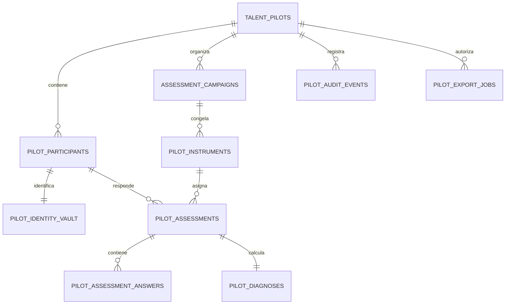

# Almacenamiento de los 20 participantes reales del piloto

## Decisión de alcance

Este documento define el **diseño propuesto**, no una habilitación de carga de datos personales. La demostración vigente permanece poblada exclusivamente con datos sintéticos. Antes de incorporar a los veinte participantes reales de Itti, se debe activar la identidad corporativa, el control de acceso en servidor y el aislamiento del piloto. En términos prácticos, la base de datos actual es la bóveda de una maqueta: ya contiene campañas operativas, pero todavía no tiene las cerraduras necesarias para información identificable.

> Los resultados del Perfilador son señales para una conversación de desarrollo. No deben usarse como una decisión automática de promoción, compensación, movilidad, permanencia o medida disciplinaria.

## Principios de diseño

El piloto debe conservar la menor cantidad posible de información identificable, separar la identidad de las respuestas y permitir reconstruir cada cálculo. Los datos de demo y de personas reales no compartirán identificadores, tablas de trabajo ni exportaciones.

| Principio | Decisión de implementación |
|---|---|
| Separación demo / real | Crear un `pilot_id` explícito y una clasificación `demo` o `real`; las consultas de demo nunca deben seleccionar campañas reales. |
| Minimización | Cargar únicamente identificador corporativo, nombre para la operación de People & Culture, rol, seniority, área y squad cuando sean necesarios para la matriz. No incorporar fecha de nacimiento, domicilio, remuneración, documentos ni información médica. |
| Pseudonimización | Generar un `participant_id` UUID y un código de reporte; las respuestas y los diagnósticos se relacionan con ese identificador, no con el correo o el nombre. |
| Trazabilidad | Versionar instrumento, matriz, fórmula y cada cambio de estado. Mantener un evento de auditoría por lectura sensible, asignación, envío, cálculo, exportación y revocación. |
| Acceso de mínimo privilegio | Aplicar identidad corporativa y RBAC en servidor antes de importar. People & Culture administra campañas; el colaborador accede solo a su propia evaluación y reporte; los exportadores requieren un permiso separado. |
| Retención y salida | Definir, aprobar y automatizar una ventana de retención antes de empezar. Al cierre, anonimizar o eliminar respuestas e identidades conforme a la política aprobada y conservar solo métricas agregadas cuando estén autorizadas. |

## Estado de la base actual y uso recomendado

Las tablas `assessment_campaigns`, `assessment_campaign_participants` y `assessment_campaign_reminders` resuelven campañas, participantes y recordatorios idempotentes. Son un punto de partida válido para la **operación de campaña**, pero no constituyen por sí solas un modelo apto para datos reales: `assessment_campaign_participants` replica nombre y rol, no tiene aislamiento de piloto ni un enlace a evaluaciones, respuestas, consentimiento, auditoría o retención.

La recomendación es conservar estas tablas para la transición y añadir un modelo de piloto real separado. La tabla de participantes de campaña deberá migrar gradualmente de campos de identidad duplicados a una referencia `pilot_participant_id`; mientras la migración esté incompleta, la aplicación no debe mezclar ambos orígenes en una misma pantalla o exportación.

## Modelo de datos propuesto

| Entidad | Finalidad | Campos esenciales | Datos a evitar |
|---|---|---|---|
| `talent_pilots` | Delimita el piloto, propietario, clasificación y fechas. | `id`, `code`, `data_classification`, `status`, `started_at`, `ended_at`, `retention_until`. | Datos del colaborador. |
| `pilot_participants` | Mantiene la identidad mínima y el seudónimo de cada una de las 20 personas. | `id` UUID, `pilot_id`, `employee_external_id`, `display_name`, `role`, `seniority`, `area`, `squad`, `report_code`, `status`, `created_at`. | Respuestas, notas de manager, atributos sensibles. |
| `pilot_identity_vault` | Aísla los contactos requeridos para avisos e identidad. | `participant_id`, `corporate_email_ciphertext`, `key_version`, `updated_at`. | Contraseñas, tokens, información fuera del piloto. |
| `pilot_instruments` | Congela el instrumento que recibió cada persona. | `id`, `campaign_id`, `matrix_version`, `formula_version`, `instrument_json`, `approved_by`, `approved_at`, `checksum`. | Datos personales. |
| `pilot_assessments` | Registra asignación, progreso, envío e inmutabilidad. | `id`, `instrument_id`, `participant_id`, `state`, `assigned_at`, `submitted_at`, `locked_at`. | Nombre y correo duplicados. |
| `pilot_assessment_answers` | Guarda respuestas estructuradas por pregunta. | `assessment_id`, `question_id`, `flow`, `response_json`, `scored_value`, `submitted_at`. | Texto libre no requerido; adjuntos sin política y antivirus. |
| `pilot_diagnoses` | Conserva el resultado reproducible por flujo. | `assessment_id`, `formula_version`, `result_json`, `calculated_at`, `calculated_by`. | Inferencias no explicables o recomendaciones de empleo. |
| `pilot_audit_events` | Evidencia de operación y acceso sensible. | `id`, `pilot_id`, `actor_id`, `action`, `entity_type`, `entity_id`, `occurred_at`, `metadata_minimized`. | Respuestas completas o PII dentro del log. |
| `pilot_export_jobs` | Controla las exportaciones aprobadas y su ciclo de vida. | `id`, `pilot_id`, `requested_by`, `scope`, `format`, `status`, `expires_at`, `storage_key`, `checksum`. | Archivos permanentes en el servidor local. |

La tabla `pilot_identity_vault` es deliberadamente separada: permite realizar recordatorios internos sin hacer que cada respuesta o diagnóstico transporte correo y nombre. En producción, su contenido debe cifrarse a nivel de aplicación con gestión centralizada de claves; el valor cifrado y la versión de clave se almacenan, pero la clave nunca se registra en la base de datos ni en el repositorio.

## Relaciones y límites de consulta

Las políticas de servidor deberán imponer tres filtros en cada procedimiento: `pilot_id`, rol del actor y, para el colaborador, coincidencia entre el `participant_id` de la sesión autenticada y el recurso solicitado. La interfaz puede ocultar acciones, pero el servidor debe rechazar la operación aunque una petición sea construida manualmente.

## Integración con campañas y recordatorios

La campaña sigue siendo el contenedor de fechas y cadencia. Para el piloto real, se propone añadir `pilot_id` a `assessment_campaigns` y `pilot_participant_id` a `assessment_campaign_participants`, conservando el planificador global existente. El recordatorio solo recibe el identificador interno de participante; la resolución de contacto se realiza en un servicio de notificación autorizado, nunca desde la vista de administración.

| Elemento existente | Cambio propuesto | Resultado |
|---|---|---|
| `assessment_campaigns` | Añadir `pilot_id`, `instrument_version_id` y metadatos de creación por actor. | Una campaña queda vinculada a un único piloto e instrumento versionado. |
| `assessment_campaign_participants` | Añadir `pilot_participant_id` y retirar progresivamente nombre/rol duplicados. | La campaña opera con referencias mínimas. |
| `assessment_campaign_reminders` | Mantener `participant_id`, sumar `delivery_channel` y metadatos mínimos de entrega. | La idempotencia se conserva sin guardar el correo en el aviso. |
| Scheduler horario | Mantener ejecución global filtrada por campañas activas autorizadas. | No se crean tareas por persona ni se expone PII en el planificador. |

## Exportación de resultados

El reporte de People & Culture debe ser **mínimo, con propósito definido y auditable**. Para una sesión individual, el reporte de colaborador muestra únicamente el resultado propio. Para análisis de piloto, se recomienda una exportación pseudonimizada por defecto con `report_code`, área agregada, versión de instrumento, cobertura, puntajes por flujo y brechas explicables. El nombre y el identificador corporativo solo se incluyen cuando una política aprobada lo justifique y el actor tenga permiso de exportación nominativa.

Los archivos deben generarse bajo demanda, guardarse en almacenamiento de objetos con un `storage_key` asociado a `pilot_export_jobs`, descargarse mediante URL temporal y eliminarse al vencer. No se deben almacenar CSV, XLSX ni resultados en el sistema de archivos local de la aplicación.

## Secuencia de puesta en marcha

| Etapa | Condición de salida | Resultado verificable |
|---|---|---|
| 0. Gobierno | People & Culture aprueba propósito, participantes, matriz, retención y responsables. | Acta de aprobación y política de retención registrada. |
| 1. Seguridad | H1/SSO y RBAC de servidor activos; pruebas negativas de acceso aprobadas. | Un colaborador no puede leer datos de otro y un rol sin permiso no exporta. |
| 2. Persistencia | Migraciones del modelo, claves foráneas, índices por `pilot_id` y auditoría aplicadas. | Pruebas de integridad, aislamiento y restauración de evaluación. |
| 3. Importación controlada | Se cargan los 20 registros desde una fuente aprobada, con validación y deduplicación. | Informe de importación con 20 códigos de reporte y cero datos demo vinculados. |
| 4. Operación | Campaña, recordatorios internos, autoevaluación y reporte propio en entorno restringido. | Evidencia de avisos idempotentes y de envío inmutable por participante. |
| 5. Cierre | Exportaciones aprobadas, revocación de accesos y retención/anonimización ejecutada. | Bitácora de cierre y comprobante de eliminación o anonimización. |

## Decisiones pendientes de People & Culture

Antes de pasar de diseño a migración, People & Culture debe confirmar el propietario funcional del piloto, la fuente de los identificadores corporativos, el canal interno de avisos, el período de retención, el criterio para una exportación nominativa, quién puede ver resultados individuales y el mecanismo de acompañamiento humano para las conversaciones de desarrollo. Hasta que estas definiciones estén aprobadas y H1 esté activo, el sistema debe seguir usando solamente información sintética.
